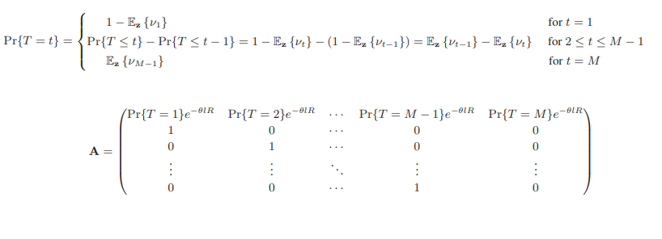
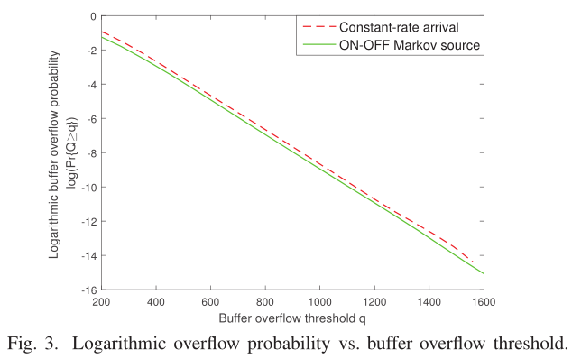
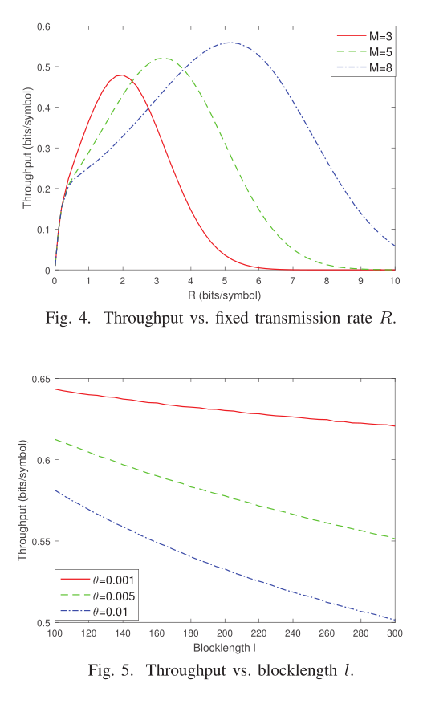

---

作者：hfc

时间：2022-11-18-14:22

---

## 1.Throughput of HARQ-IR with Finite Blocklength Codes and QoS Constraints

- 作者：Yi Li, M. Cenk Gursoy and Senem V elipasalar

- 期刊：2017 IEEE International Symposium on Information Theory (ISIT)

- 摘要：本文研究了具有有限块长码的混合自动重复请求(HARQ)方案在统计排队约束和时间期限限制下的恒速率和ON-OFF离散马尔可夫到达的吞吐量。在分析解码错误概率和中断概率的基础上，描述了传输周期的分布，得到了两种到达模型的吞吐量表达式。通过蒙特卡罗模拟验证了分析结果。在数值结果中，分析了时间期限约束、固定传输速率、编码块长和排队约束对吞吐量的影响。
- 关键词—Hybrid ARQ, incremental redundancy, Markov arrivals, QoS constraints, recurrence relation approach.

### 系统模型

- 点对点通信，排队约束，衰落系数在一个块内保持不变，在不同块之间独立变化，假设ACK/NACK的发送接收没有延时

- 设发射机在排队约束下工作，这要求缓冲区溢出概率以指数级快速衰减
  $$
  Pr\{Q \geq q\} \approx \sigma e^{-\theta q}
  $$
  $Q$是平稳队列长度，$\sigma = Pr\{Q > 0 \}$是非空缓存区的概率，$\theta$是QoS指数，更严格定义为
  $$
  \theta = \lim_{q \rightarrow \infty}\frac{-\log Pr\{Q \geq q \}}{q}
  $$
  有效带宽和有效容量公式，瞬时到达速率$a_i(bits/block)$和离开速率$c_i(bits/blocks)$在排队约束性有
  $$
  \Lambda_a(\theta) + \Lambda_c(-\theta) = 0
  $$
  其中$\Lambda_p(\theta) = \lim_{t \rightarrow \infty} \frac{1}{t} \ln \mathbb{E}\{\exp(\theta \sum_{i=1}^t p_i) \}$被称为随机过程$p_i$的对数矩母函数

- 当接收器正确接收到包或由于时间限制而丢弃包时，瞬时离开率为$c_i = lR(bits/block)$，其他情况$c_i = 0$，到达速率恒定且为$a$，可得$a_i = la(bit/block)$，可得
  $$
  \Lambda_a(\theta) = la\theta
  $$

  $$
  la = - \frac{1}{\theta} \Lambda_c(-\theta) = C_E(\theta, SNR)
  $$

  (5)右侧为无线链路有效容量，在恒定速率到达假设下，吞吐量为（块长度$l$归一化）
  $$
  r_{th} = \frac{(1 - \epsilon)C_E(\theta, SNR)}{l} = -\frac{1 - \epsilon}{l\theta} \Lambda_c(-\theta)
  $$

### 排队约束和有限块长码的HARQ-IR吞吐量

- 假设到达速率恒定，根据结论，固定传输速率和错误概率之间的关系由下式
  $$
  R = \sum_{i=1}^m\log_2(1 + SNR z_i) - \sqrt{\sum_{i=1}^m\frac{(SNR z_i + 2)SNR z_i}{l(SNR z_i + 1)^2}}Q^{-1}(\nu)\log_2e + \frac{\log(ml)}{l} + \frac{o(1)}{l}
  $$
  其中$\nu$是解码错误概率，$z_i = |h_i|^2$，得到第$m$次传输或解码失败的概率为
  $$
  \nu_m = Q\Bigg(\frac{\sum_{i=1}^m\log_2(1 + SNR z_i) + \frac{\log(ml)}{l} - R}{\log_2e \sqrt{\sum_{i=1}^m\frac{(SNR z_i + 2)SNR z_i}{l(SNR z_i + 1)^2}}} \Bigg)
  $$
  传输周期的持续时间$T$，接收方在$t$次尝试中解码数据包的概率为
  $$
  Pr\{T \leq t \} = 1 - \mathbb{E}_z\{\nu_t \}
  $$
  $M$次解码失败的中断概率为
  $$
  \epsilon = \mathbb{E}_z\{\nu_M \}
  $$

  由公式(6)
  $$
  r_{th} = (1 - \epsilon)C_E/l
  $$
  由(5)得
  $$
  C_E = -\frac{1}{\theta} \ln(\max\{|\lambda_1|,\cdots,|\lambda_M| \})
  $$
  其中$\overrightarrow{\lambda}$矩阵是矩阵$A$的特征，

  

- ON-OFF离散马尔可夫：定义两个状态 $state_1 = \lbrace OFF:source-keep-silent \rbrace$，$state_2=\lbrace ON:arrival-rate,a_i = lr(bits/block) \rbrace$ ，其中$r$为到达恒定速率，转移概率矩阵为
  $$
  G = 
  \begin{bmatrix}
  p_{11} & p_{12} \\
  p_{21} & p_{22}
  \end{bmatrix}
  $$
  其中$p_{11}$和$p_{22}$表示源在下一个时间块中保持相同状态（分别为OFF和ON状态）的概率，$p_{12}$和$p_{21}$表示源将在下一时间块中转换到不同状态的概率，因此$ON$状态的概率为
  $$
  P_{ON} = \frac{1 - p_{11}}{2 - p_{11} - p_{22}}
  $$
  该模型下平均到达速率为
  $$
  r_{avg} =  r P_{ON} = r\frac{1 - p_{11}}{2 - p_{11} - p_{22}}
  $$
  推导出了，固定传输速率$R$,截止时间约束$M$和$QoS$指数$\theta$的$ON-OFF$离散时间马尔可夫源，吞吐量为
  $$
  r_{th} = \frac{1 - \epsilon}{l}\frac{P_{ON}}{\theta}\log \Big(\frac{e^{2 \theta C_E} - p_{11}e^{\theta C_E}}{1 - p_{11} - p_{22} + p_{22}e^{\theta C_E}} \Big)
  $$
  其中$C_E$由(12)得到

- 结论，如果在较长时间内保持$ON$状态，则源的突发性较低，因此对于固定的平均到达率$r_{avg}$，瞬时到达率r较小。对于具有相同$r_{avg}$的不同源，具有较小突发度或等效较小瞬时到达率$r$的源在满足排队约束方面更有利。

### 画图验证

