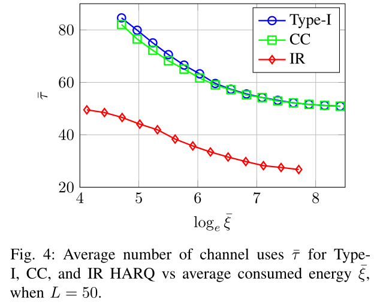
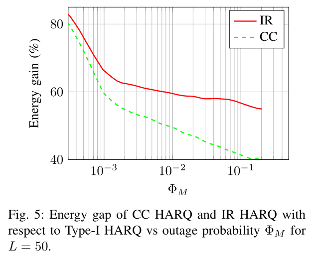

---

作者：hfc

时间：2022-11-18-14:22

---

- ## 3.A Comparison of Energy-Efficient HARQ Protocols for M2M Communication in the Finite Block-Length Regime

  - 作者：Marco Centenaro, Student Member , IEEE, Giulio Ministeri, Student Member , IEEE,
    and Lorenzo V angelista, Senior Member , IEEE
  
  - 期刊：
  
  - 摘要：摘要混合自动重传请求（HARQ）技术主要用于无线通信系统的上下文中，尤其是在最近几年中，被用于最新的蜂窝系统，包括长期演进（LTE）标准。此类方案已在文献中得到广泛研究；然而，在本文中，我们感兴趣的是将PolyanskiyPoor-Verdú的结果应用于有限块长度方案，比较绿色通信环境下（即，在能效是关键性能指标的情况下）类型I和类型II HARQ方案的性能。
  
    这方面的一个突出例子是机器对机器（M2M）通信，预计它将作为物联网（IoT）范式的推动者发挥根本作用。我们推导了一种新的、最优的功率分配策略，并提供了仿真结果，表明如果我们在接收器侧启用分组合并，可以实现至少40%的节能
  
  - 关键词
  
  ### 系统模型
  
  - 假设从字母表$M$中取出每个发送的符号，并且将$b$个信息符号编码为属于集合$M^L$的码字，使用$L$个信道的码字来发送，码字速率为
    $$
    R = \frac{\log_2 |\mathcal{M|}^b}{L} = \frac{b}{L}~bpcu \tag{1}
    $$
    $h$服从瑞利分布，衰落过程在每个传输码字上是平坦的，并且衰落实现在不同块之间是独立的。$g = |h|^2$均值$\lambda = 1$，噪声功率$\sigma^2_w = 1$，由可知传输速率、香农容量和错误概率之间的关系由下式
    $$
    R = C - \sqrt{\frac{V}{L}} \cdot Q^{-1}(\epsilon) + \frac{1}{2}\cdot\frac{\log_2 L}{L} + \mathcal{O}(1) \tag{2}
    $$
    其中$C = \frac{1}{2}\log_2 (1 + \Gamma)$，信道色散为
    $$
    \begin{aligned}
    V &= \frac{1}{2} \cdot \frac{\Gamma(\Gamma + 2)}{(\Gamma + 1)^2}(\log_2 e)^2\\
    &=\frac{1}{2}\Big[1 - \frac{1}{(\Gamma+1)^2} \Big](\log_2 e)^2
    \end{aligned} \tag{3}
    $$
    通带信道香农容量和信道色散必须乘以$2$，
  
  - 给定$L,R,P,g$可得解码错误概率为
    $$
    \phi \approx \mathbb{E}_g\Bigg[Q\Bigg(\frac{\sqrt{L}\log_2(1 + gP) + \frac{1}{2}\cdot\frac{\log_2 L}{L} - R}{\sqrt{1 - \frac{1}{(1 + gP)^2}}\log_2e} \Bigg) \Bigg] \tag{4}
    $$
    设$M$为重传最大次数，$P_m$为表示第$M$次传输中使用的传输功率，$\Phi_m$表示直到第$M$次尝试传输才正确解码数据的概率，$\Phi_0 = 1$。平均消耗能量定义为
    $$
    \bar{\xi} = L \cdot \sum_{m=1}^M P_m \cdot \Phi_{m-1} \tag{5}
    $$
    信道使用的预期数量，即平均延迟为
    $$
    \bar{\tau} = L \cdot \sum_{m=1}^M \Phi_{m-1} \tag{6}
    $$
    使用**更新奖励理论**获得平均传输功率
    $$
    \bar{P} = \frac{\bar{\xi}}{\bar{\tau}} = \frac{\sum_{m=1}^M P_m \cdot \Phi_{m-1}}{\sum_{m=1}^M \Phi_{m-1}} \tag{7}
    $$
  
  - 设计了一个类似的优化问题来研究$I$型-$HARQ,CC-HARQ$和$IR-HARQ$进程之间的性能差距
    $$
    \min_{P_m}\Phi _M\\ \tag{8}
    $$
    
    $$
    subject\quad to\quad \bar{\xi}=J \tag{8}
    $$
    
    $$
    P_{\min}\leq P_m\leq P_{\max} \tag{8}
    $$
    
    在间隔$\left[ P_{\min}，P_{\max} \right]$中强制发送功率$P_m$，这是真实设备的常见约束。这样得到了平均消耗能量$\bar{\xi}$上下界
    $$
    \bar{\xi}=L\cdot \sum_{m=1}^M{P}_m\cdot \Phi _{m-1}\geq L\cdot \sum_{m=1}^M{P}_{\min}\cdot \Phi _{m-1}\geq L\cdot P_{\min}\triangleq J_{\min} \tag{9}
    $$
    
    
    
    
    $$
    \bar{\xi}=L\cdot \sum_{m=1}^M{P}_m\cdot \Phi _{m-1}\leq L\cdot \sum_{m=1}^M{P}_{\max}\cdot \Phi _{m-1}\leq L\cdot P_{\max}\cdot M\triangleq J_{\max} \tag{10}
    $$
  
  #### Type-I HARQ
  
  - 接收端尝试只解码最后接收到的包，丢弃之前接收到的信息，得到
    $$
    \Phi _{m}^{\left( TI \right)}=
    \begin{cases}
    	\prod_{j=1}^m{\phi}_j&		m\ne 0\\
    	1&		m=0\\
    \end{cases}\tag{11}
    $$
    其中，$\phi_j$是在第$j$次传输尝试中数据未被解码的概率，$\phi_j = \mathbb{E}_g[\epsilon(L,R,gP_j)]$
  
  #### CC-HARQ
  
  - 接收到的包使用利用最大比率组合（MRC）完成分组的组合，第$j$次传输尝试后的有效$SNR$为
    $$
    \Gamma_j^{(CC)} = \sum_{\alpha = 1}^j \Gamma_\alpha = \sum_{\alpha = 1}^j \frac{g_\alpha P_a}{\sigma_w^2} \tag{12}
    $$
    第$j$次传输尝试时的解码错误概率$\phi_j^{(CC)}$表示
    $$
    \begin{aligned}
    \phi_j^{(CC)}& = \mathbb{E}_{g_1,\cdots,g_j}\Bigg[\epsilon\Bigg(L,R,\sum_{\alpha = 1}^j g_\alpha P_\alpha \Bigg) \Bigg] \\
    &= \underset{j~integrals}{\int_0^{+\infty} \cdots \int_0^{+\infty}}\epsilon\Bigg(L,R,\sum_{\alpha = 1}^j g_\alpha P_\alpha \Bigg)e^{-\sum_{\alpha = 1}^j g_\alpha}dg
    \end{aligned} \tag{13}
    $$
    这里利用了独立块衰落过程的假设
    $$
    f_{g_1,\cdots,g_j}(g_1,\cdots,g_j) = f_{g_1}(g_1)\cdots f_{g_m}(g_m) = \exp(-\sum_{i=1}^m g_i) \tag{14}
    $$
    因此，第$m$次传输尝试的中断概率为
    $$
    \Phi_m^{(CC)} = 
    \begin{cases}
    \prod_{j=1}^m \phi_j^{(CC)} & m \neq 0 \\
    1 & m = 0
    \end{cases} \tag{15}
    $$
  
  #### IR-HARQ
  
  - 采用$L$个信道用于传输的原始码字被划分为$L/M$个子码字，其中$M$是传输尝试的最大次数。我们可以使用具有瑞利衰落的$M$并行AWGN信道[14]来模拟这种情况。公式(29)可得
    $$
    R_j = C_j - \sqrt{\frac{V_j}{L/M}} \cdot Q^{-1}(\epsilon) + \frac{1}{2}\cdot\frac{\log_2 L/M}{L/M} + \mathcal{O}(1) \tag{16}
    $$
    其中累计信道容量$C_j$为
    $$
    C_j = \sum_{\alpha = 1}^j C(g_\alpha P_\alpha) \tag{17}
    $$
    累积信道色散$V_j$为
    $$
    V_j = \sum_{\alpha = 1}^j V(g_\alpha P_\alpha) \tag{18}
    $$
    其中${P_1,\cdots,P_j}$为发射功率，$g_1\cdots g_j$为信道增益。
  
  - 假设$FEC$码的母码率为$R = b/L$，第$j$次传输尝试后的信息速率为
    $$
    R_j = \frac{b}{j \cdot \frac{L}{M}} = R \cdot \frac{M}{L} \tag{19}
    $$
    而$R_M \equiv R$，因此误差概率为
    $$
    \epsilon_j^{(IR)}\approx Q\Bigg(\frac{C_j + 0.5\frac{\log_2L/M}{L/M} - R_j}{\sqrt{V_j/\frac{L}{M}}} \Bigg) \tag{20}
    $$
    因此在第$j$次传输尝试的解码错误概率表示为
    $$
    \begin{aligned}
    \phi_j^{(IR)}& = \mathbb{E}_{g_1,\cdots,g_j}\Big[\epsilon_j^{(IR)} \Big] \\
    &= \underset{j~integrals}{\int_0^{+\infty} \cdots \int_0^{+\infty}} \epsilon_j^{(IR)} e^{-\sum_{\alpha = 1}^j g_\alpha}dg
    \end{aligned} \tag{21}
    $$
    第$m$次传输尝试时的中断概率为
    $$
    \Phi_m^{(IR)} = 
    \begin{cases}
    \prod_{j=1}^m \phi_j^{(IR)} & m \neq 0 \\
    1 & m = 0
    \end{cases} \tag{22}
    $$
  
  ### 性能评估
  
  #### 中断概率
  
  - 为了减少支持数据重传所需的缓冲量，成本和延迟敏感的机器类型设备来说是一个非常重要的限制，取$L \in \{50,200 \},M = 2$，如下图展示了中断概率$\Phi_M$和平均消耗能量$\bar \xi$的比较。
  
    
  
    可知$IR-HARQ$具有最佳性能，$\bar \xi$在对数尺度变化是$\ln (200/50)\approx 1.4$
  
  #### 功率分配
  
  - 下图展示了$M$次传输尝试的功率分配与$L=50$时的平均消耗能量$\bar \xi$
  
    
    
    对于两种$TypeII-HARQ$过程，当能量预算$\bar \xi$较低时，最好的做法是在第一次传输尝试时分配更多的功率，即$P_1 > P_2$。当可用能量较高时，特别是使用$CC$当$\ln \bar\xi > 5$和使用$IR$当$\ln \bar \xi > 5.3$时，更优的方案是在第二次传输尝试上分配更多的功率即$P_1 < P_2$。
  
  #### 交付延时
  
  
  
  #### 能效
  
  
  
  结论：$IR-HARQ$在节能方面总是优于$CC-HARQ$。